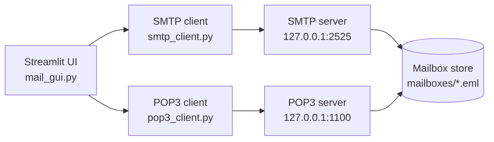
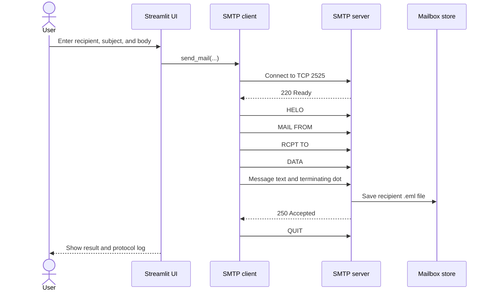
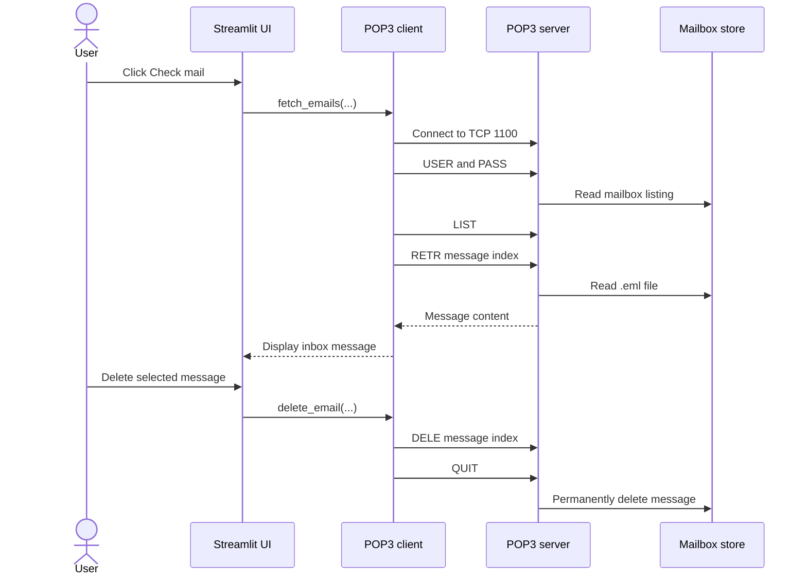

# Local Email Communication System

A small local email system built to demonstrate how SMTP sends mail and POP3 retrieves it. The application runs entirely on one machine: Streamlit provides the interface, while two Python socket servers handle SMTP and POP3 traffic.

This is an educational implementation for local testing, not a production mail server.

## Features

- Compose and send plain-text email through SMTP.
- Authenticate users through POP3.
- List and retrieve mailbox messages.
- Mark messages for deletion and commit deletion on `QUIT`.
- Show SMTP and POP3 commands and responses in the Streamlit interface.
- Store mail locally as `.eml` files.

## Architecture



`mailbox_store.py` is the shared storage layer. The SMTP server writes messages to it, and the POP3 server reads or deletes messages from it.

## Message Flow

### Sending mail with SMTP



### Retrieving mail with POP3



## Project Files

| File | Purpose |
|---|---|
| `mail_gui.py` | Streamlit entry point. Starts both servers, handles login, compose, inbox, deletion, and protocol logs. |
| `smtp_server.py` | Multithreaded SMTP server on `127.0.0.1:2525`. Validates the basic SMTP command sequence and saves accepted messages. |
| `smtp_client.py` | SMTP client used by the Streamlit interface to send mail. |
| `pop3_server.py` | Multithreaded POP3 server on `127.0.0.1:1100`. Supports `USER`, `PASS`, `STAT`, `LIST`, `RETR`, `DELE`, and `QUIT`. |
| `pop3_client.py` | POP3 client used to fetch and delete messages. |
| `mailbox_store.py` | Creates users and mailbox folders, authenticates users, and saves, lists, reads, and deletes `.eml` files. |
| `users.json` | Local username/password data. Created automatically if missing. |
| `mailboxes/` | Local mailbox data. Created automatically; do not commit private mail contents. |
| `requirements.txt` | Python dependency list. |
| `Local_Email_Communication_System_prd.txt` | Original project requirements and protocol background. |

## Setup and Run

PowerShell on Windows:

```powershell
.\venv\Scripts\Activate.ps1
python -m pip install -r requirements.txt
streamlit run mail_gui.py
```

Open the URL printed by Streamlit, normally `http://localhost:8501`.

The application starts the SMTP and POP3 servers automatically when the Streamlit session initializes. Do not separately run `smtp_server.py` or `pop3_server.py` while using the Streamlit app.

## Demo Accounts

The default accounts are:

| Account | Password |
|---|---|
| `alice@local` | `password123` |
| `bob@local` | `password123` |

A simple demonstration is:

1. Log in as `alice@local`.
2. Send a message to `bob@local`.
3. Log in as `bob@local` in another browser tab or session.
4. Click **Check mail**.
5. Open or delete the retrieved message.
6. Inspect the **Protocol Log** tab to see the SMTP and POP3 exchanges.

## Storage and Scope

Messages are plain-text files under `mailboxes/<email>/`. Credentials are stored locally in `users.json`.

The implementation intentionally supports only local, plain-text mail. It does not provide TLS, real internet delivery, IMAP, attachments, spam filtering, or production-grade account security.
